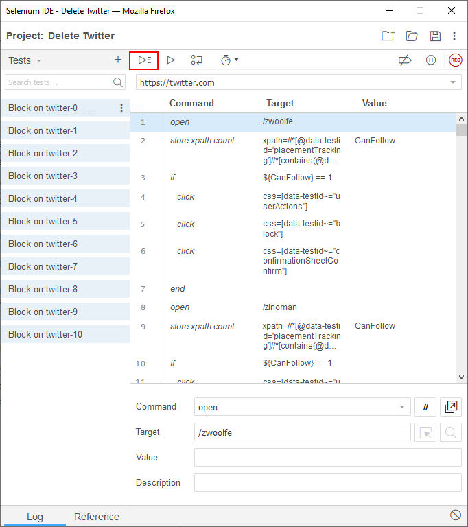

# BlockTwitter side file

## What is the BlockTwitter.side file?

This file allows you to automate your browser to block all the twitter handles in our list.

We will not block accounts that you are following.

## How to use it?

For this, you need first to install [Selenium IDE](https://www.selenium.dev/selenium-ide/), which is a browser extension to automate your browser.

### Step 1: Disable CSP

For Selenium to work properly on Firefox, you need to disable CSP. Do not forget to re-enable it after you are done.

It might not be necessary on Chrome.

### Step 2: Login in to your twitter account.
### Step 3: Run the side file

Save the [side file](https://raw.githubusercontent.com/NicolasDorier/CancelMSM/master/BlockTwitter.side) somewhere on your computer.

Run Selenium IDE, and open the side file.

You can then click on the play button.

## Note

This file is generated by our build tools, please do not edit manually.

## Known issue

Some twitter accounts do not get blocked properly while the side script is running. It happens randomly, running the side script several time will workaround the problem.
